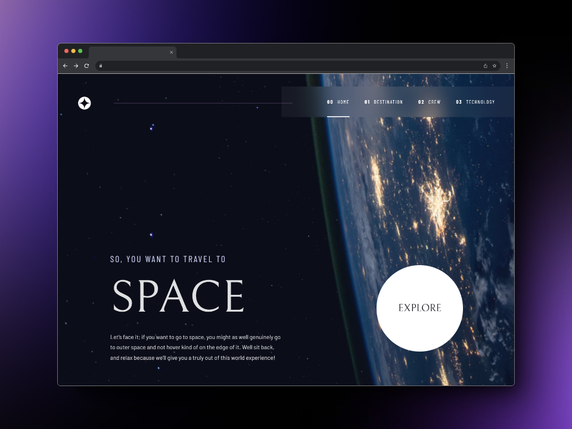
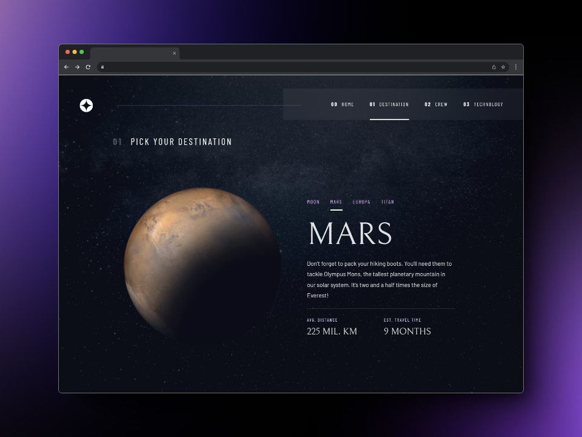
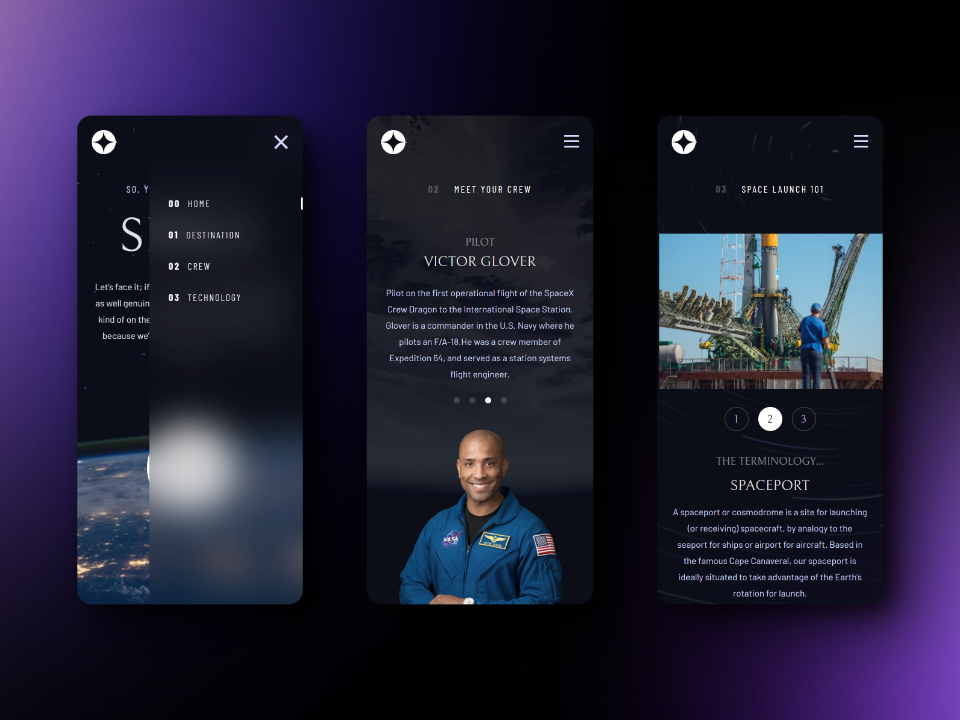

#  Space tourism website

This project was created using React, TypeScript and Vite.js, a fast and modern build tool for web projects.

## Getting Started

To get started with the project, you'll need to use the following scripts:

### Development Server

To start the development server, run:
```
pnpm run dev
```
This command starts a local development server with hot module replacement, allowing you to see your changes in real-time as you edit your code.
### Build for Production

To start the development server, run:
```
pnpm run build
```
This command bundles your application into static files for production. It optimizes the output for the best performance.
### Preview Production Build

To start the development server, run:
```
pnpm run preview
```
This command serves the files generated from the build command locally, allowing you to inspect the production build and ensure it works as expected before deploying.

# Frontend Mentor - Space tourism website solution

This is a solution to the [Space tourism website challenge on Frontend Mentor](https://www.frontendmentor.io/challenges/space-tourism-multipage-website-gRWj1URZ3). Frontend Mentor challenges help you improve your coding skills by building realistic projects. 

## Overview

### The challenge

Users should be able to:

- View the optimal layout depending on their device's screen size
- See hover states for interactive elements

### Screenshot





### Links

- Solution URL: [Repository Github here](https://github.com/GonzaloGC/space-tourism-website)
- Live Site URL: [Deploy at Vercel here](https://space-tourism-bice-gamma.vercel.app/)

## My process

### Built with

- Semantic HTML5 markup
- Flexbox
- Grid
- Mobile-first workflow
- [React](https://reactjs.org/) - JS library
- [TypeScript](https://www.typescriptlang.org/) - JavaScript with syntax for types
- [Vite js](https://vitejs.dev/) - Next Generation Frontend Tooling

### What I learned

Define an interface and a module with TypeScript to work with JSON data. The aria-label attribute of the HTML button tag is important for accessibility and especially useful for visually impaired users who use screen readers to navigate the web. The robots.txt file is used to indicate to search engine robots, like Google or Bing, which pages of the site they can crawl and index and which ones they cannot.

### Continued development

To continue perfecting my skills in frontend technologies such as React.js and TypeScript and learn backend with Nodejs and Express.

### Useful resources

- [squoosh](https://squoosh.app/) - Squoosh is the ultimate image optimizer that allows you to compress and compare images with different codecs in your browser.
- [React Router](https://reactrouter.com/) - React Router is a JavaScript (JS) library that allows you to add routing to a React web application or a React Native application.

## Author

- Frontend Mentor - [@GonzaloGC](https://www.frontendmentor.io/profile/GonzaloGC)
- Twitter - [@gonzaloelias](https://twitter.com/gonzaloelias)
